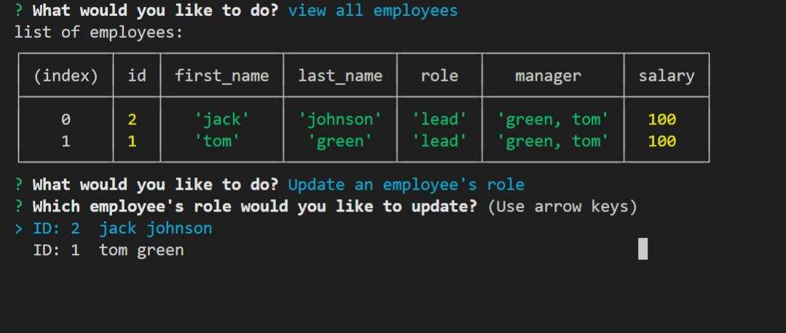

# Employee Tracker with SQL 


## Description

A command line and Mysql based application to manage a database of employees. Built using mysql2, inquirer and express.

## Table of Contents

* [Installation](#installation) 
* [Usage](#usage) 
* [Features](#features) 
* [License](#license) 


## Installation
To install necessary dependencies, run the following command:
  ```
  npm i
  ```

  Dependencies inclue express, inquierer, mysql2, dotenv.

## Usage

After installing the dependencies in package.json through npm i, run node index.js. Follow the given propmts to manipulate data as you see fit.




## Features

- add employee
- role and department
- update employee role


## License
This project is licensed under the MITLicense: It lets people do almost anything they want with your project, like making and distributing closed source versions license.


## Questions

If you have any questions about the repo, open an issue or contact me directly at trevorHilimire@gmail.com
This project was created by Github user: [Trv893](https://github.com/trv893/)
